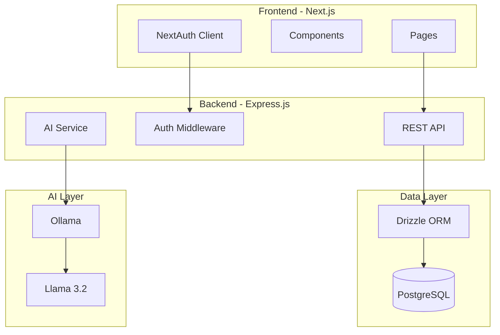
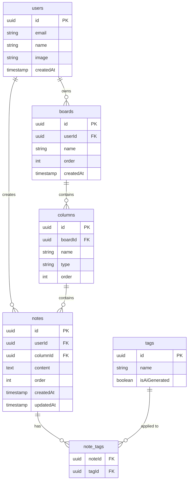

# Jottie - Project Progress Tracker

> Kanban-style note board with AI-powered categorization

## Progress Checklist

### Phase 0: Foundation ✅
- [x] Initialize monorepo with frontend (Next.js) and backend (Express.js) directories
- [x] Create `.env.example` with all required environment variables
- [x] Create `.gitignore`

### Phase 1: Infrastructure (Agent A) ✅
- [x] Create `docker-compose.yml` with PostgreSQL and Ollama services
- [x] Define Drizzle schema (users, boards, columns, notes, tags)
- [x] Generate initial database migration
- [x] Set up Express.js server with TypeScript and routes structure

### Phase 1: Frontend Setup (Agent B) ✅
- [x] Initialize shadcn/ui with required components
- [x] Configure Tailwind with Jottie theme
- [x] Create typed API client for backend communication
- [x] Define TypeScript types (Board, Column, Note, Tag)

### Phase 1: Auth Setup (Agent C) ✅
- [x] Configure NextAuth.js v5 with credentials provider
- [x] Set up SessionProvider in root layout
- [x] Create auth middleware for protected routes (in `proxy.ts`)

### Phase 2: Backend APIs (Agent A) ✅
- [x] Implement auth middleware (JWT verification)
- [x] Implement boards CRUD endpoints
- [x] Implement columns CRUD endpoints
- [x] Implement notes CRUD endpoints with tag management

### Phase 2: Board UI (Agent B) ✅
- [x] Build `<Column>` component with header and note list
- [x] Build `<NoteCard>` component with content preview and tags
- [x] Create board listing page at `/boards`
- [x] Create single board view at `/boards/[id]`

### Phase 2: Auth & Editor Pages (Agent C) ✅
- [x] Build login page with form validation
- [x] Build registration page
- [x] Create Google Keep-style note editor at `/notes/[id]`
- [x] Build hashtag input component with `#` trigger

### Phase 3: AI Integration (Agent A) ✅
- [x] Create Ollama service for Llama 3.2 integration
- [x] Implement `POST /api/ai/suggest` endpoint

### Phase 3: Drag & Drop (Agent B) ✅
- [x] Install and configure @dnd-kit
- [x] Make notes draggable between columns
- [x] Implement optimistic UI updates on drag-drop

### Phase 3: AI UI & Polish (Agent C) ✅
- [x] Add AI suggestion button in note editor
- [x] Build suggestion acceptance/rejection UI
- [x] Add category selector dropdown
- [x] Final styling polish

---

## Architecture Overview



## Project Structure

```
noteboard2/
├── frontend/                 # Next.js app
│   ├── app/
│   │   ├── (auth)/          # Auth pages (login, register)
│   │   ├── boards/          # Board views
│   │   ├── notes/[id]/      # Note editing page (Google Keep style)
│   │   └── api/auth/        # NextAuth route handlers
│   ├── components/
│   │   ├── ui/              # shadcn/ui components
│   │   ├── board/           # Board, Column, NoteCard
│   │   ├── note-editor/     # Full note editor modal/page
│   │   └── dnd/             # Drag-and-drop wrappers
│   └── lib/
│       ├── auth.ts          # NextAuth config
│       └── api.ts           # Backend API client
│
├── backend/                  # Express.js server
│   ├── src/
│   │   ├── routes/          # API routes
│   │   ├── services/        # Business logic + AI service
│   │   ├── middleware/      # Auth verification
│   │   └── db/
│   │       ├── schema.ts    # Drizzle schema
│   │       └── index.ts     # DB connection
│   └── drizzle/             # Migrations
│
└── docker-compose.yml        # PostgreSQL + Ollama
```

## Database Schema



## Tech Stack

| Layer | Technology |
|-------|------------|
| Frontend | Next.js 16, React 19, TypeScript |
| UI | shadcn/ui, Tailwind CSS |
| Drag & Drop | @dnd-kit/core |
| Auth | NextAuth.js v5 |
| Backend | Express.js, TypeScript |
| Database | PostgreSQL 16 |
| ORM | Drizzle ORM |
| AI | Ollama + Llama 3.2 |
| Package Manager | Bun |
| Containerization | Docker Compose |

## API Endpoints

| Method | Endpoint | Description |
|--------|----------|-------------|
| POST | /api/auth/* | NextAuth handlers |
| GET | /api/boards | List user's boards |
| POST | /api/boards | Create board |
| GET | /api/boards/:id | Get board with columns + notes |
| POST | /api/columns | Create column |
| PATCH | /api/columns/:id | Update column (name, order) |
| DELETE | /api/columns/:id | Delete column |
| POST | /api/notes | Create note |
| GET | /api/notes/:id | Get single note (for editor) |
| PATCH | /api/notes/:id | Update note (content, column, order, tags) |
| DELETE | /api/notes/:id | Delete note |
| POST | /api/ai/suggest | Get AI category + hashtag suggestions |

## Key Features

### Board Creation Modes

**Option A: Empty Board**
- User creates a blank board with no columns
- Manually add columns (custom names like "Backlog", "In Progress", etc.)
- Manually add notes to columns

**Option B: Smart Board (AI-Organized)**
- User creates a board, adds notes freely
- AI suggests a category for each note (`!todo`, `!idea`, `!question`)
- If the suggested category column doesn't exist, prompt user to create it
- Notes auto-sort into matching columns

### Note Editor (Google Keep Style)
- Route: `/notes/[id]`
- Full-screen modal overlay
- Rich text content editing
- Inline hashtag input with `#` trigger
- AI suggestion button → shows suggested category + hashtags
- Tag chips display with remove option
- Category selector dropdown
